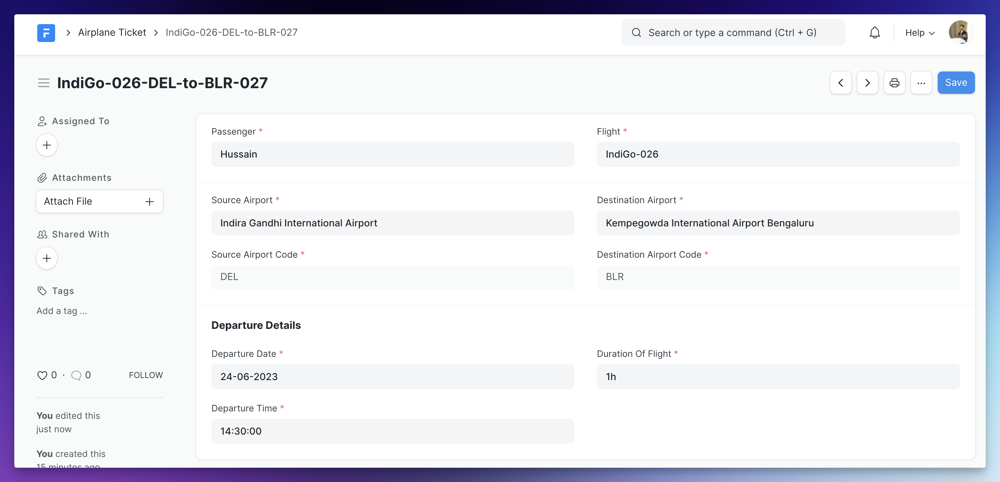
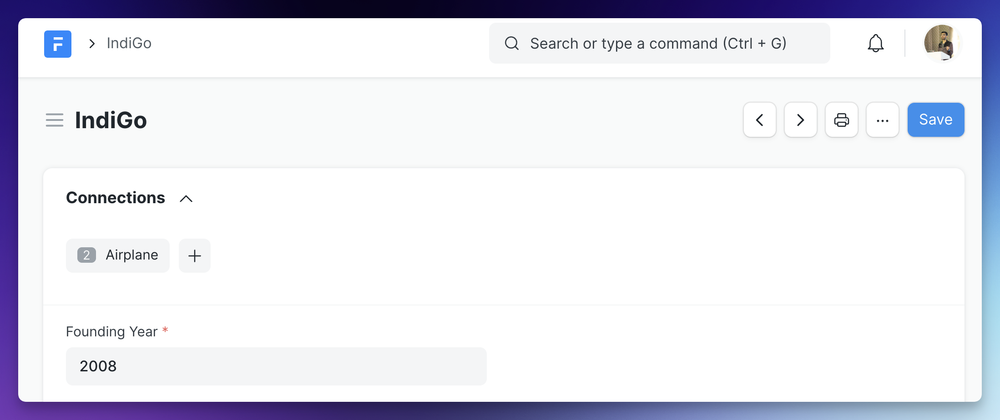
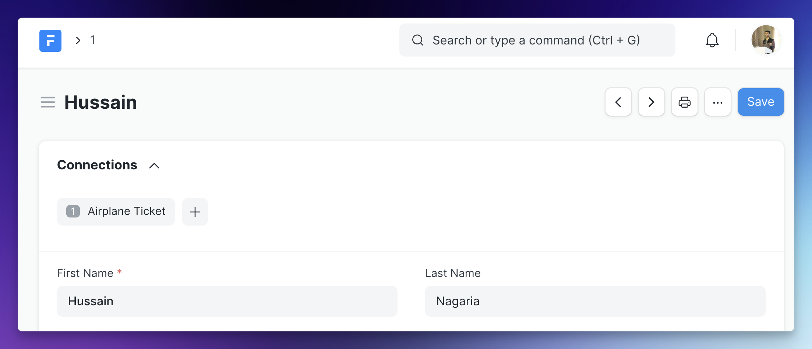
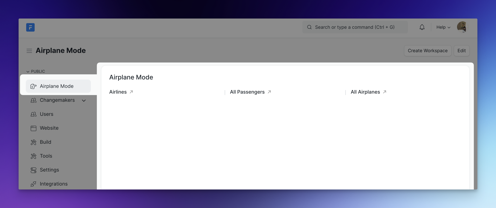

Welcome to Day 1 folks! In today's training you learned a lot about the concept of a **DocType**. Now it is time for you to explore and practice more!

## Prerequisites

Before proceeding with this exercise, make sure you do the following:

1. Create **a new site** in your local machine / bench
2. **Enable developer mode** on this site
3. Create **a new custom app and install it** on the above mentioned site (you can name the app `airplane_mode`).

## Exercise: Airplane Mode

Let us model a hypothetical flight ticket system while learning a few new concepts on the way!

### Airline DocType

Since, you now know how to create a new DocType, go ahead and create one with the following specs:

**Name**

Airline

**Fields**

0. Name (Set by user)
1. Founding Year (Int, Non-negative)
2. Customer Care Number (Data, Mandatory)
3. Headquarters (Data, Mandatory)

This DocType (master) will be used to **store the data for an Airline**. For example, AirAsia, IndiGo etc.

Go ahead, create a few sample records for this.

### Airplane DocType

**Name**

Airplane

**Fields**

0. Name (Naming Series) (Name should be of the form: `IndiGo-013`, `AirAsia-006` etc. where the first part is the name of the airline)
1. Model (Data, Mandatory)
2. Airline (**link** to Airline DocType, Mandatory)
3. Capacity (Int, Non-negative, Mandatory)

This DocType will be used to store a particular flight/airplane of a given Airline. Since, an airline can have multiple airplanes, a link field is used to link every airplane to a given airline. This is a **one-to-many relationship**, since a particular airplane can belong to only one airline.

### Airport DocType

**Name**

Airport

**Fields**

0. Name (Set by user)
1. Code (Data, Mandatory)
2. City (Data, Mandatory)
3. Country (Data, Mandatory)

This DocType will be used to store the master data for airports.

### Passenger DocType

This DocType will be used to store the details of a passenger/traveler.

**Name**

Flight Passenger

**Fields**

0. Name (Auto Increment)
1. First Name (Data, Mandatory)
2. Last Name (Data)
3. Date Of Birth (Date, Mandatory)

**Meta**

- The First Name should be the title field
- Title field should be shown in link fields

### Let's Learn Fetch From

The fetch from feature is a very handy tool when you want to fetch some fields of a DocType to another DocType where it is linked. Let me show you `Fetch From` in action:

<iframe width="560" height="315" src="https://www.youtube.com/embed/78Yp_OdXnBI" title="YouTube video player" frameborder="0" allow="accelerometer; autoplay; clipboard-write; encrypted-media; gyroscope; picture-in-picture; web-share" allowfullscreen></iframe>

:::note
Keep in mind that Fetch From only does the fetching once, it does not keep the fields in sync.
:::

### Airplane Ticket DocType

Now this a very core DocType! This DocType must be a Submittable DocType.

**Name**

Airplane Ticket

**Fields**

0. Name (Naming Series) (Name should be of the form: `IndiGo-013-BLR-to-BOM-002` where `IndiGo-013` is the airplane name, `BLR` is the code of the source airport and `BOM` is the code of the destination airport)
1. Passenger (link to Flight Passenger, Mandatory)
2. Source Airport (link to source Airport, Mandatory)
3. Destination Airport (link to destination Airport, Mandatory)
4. Source Airport Code (fetched from `Source Airport`, Read-only, Mandatory)
5. Destination Airport Code (fetched from `Destination Airport`, Read-only, Mandatory)
6. Flight (link to Airplane DocType, Mandatory)
7. Departure Date (Date, Mandatory)
8. Departure Time (Time, Mandatory)
9. Duration of Flight (Duration, Mandatory)

The form should look identical to the screenshot below, along with the column and section breaks:

:::tip
Feel free to use the new [**Form Builder**](https://www.youtube.com/watch?v=hUBB5MM4O8k) to easily layout your DocType form.
:::

**Meta**

- Any changes to a document of this DocType should be tracked.
- The source and destination airport codes should be visible in the list view
- Departure Date should be in the standard list view filters

### Document States

<iframe width="560" height="315" src="https://www.youtube.com/embed/HhtKQpcm6RI" title="YouTube video player" frameborder="0" allow="accelerometer; autoplay; clipboard-write; encrypted-media; gyroscope; picture-in-picture; web-share" allowfullscreen></iframe>

### Connections / Linked Documents

<iframe width="560" height="315" src="https://www.youtube.com/embed/CExg2ID-zmg" title="YouTube video player" frameborder="0" allow="accelerometer; autoplay; clipboard-write; encrypted-media; gyroscope; picture-in-picture; web-share" allowfullscreen></iframe>

---

:::note[Tasks]
Using the knowledge you picked up in the above two videos, complete the following tasks in your Airplane Mode app:
:::

**Ticket Status**

- Add a new field named `Status` (Select, Mandatory) in your Airplane Ticket DocType. The options should be: `Booked`, `Checked-In`, `Boarded`. The default should be `Booked`.
- Map the status to colors according to the below shown mappings:
  1. `Booked`: Gray
  2. `Checked-In`: Purple
  3. `Boarded`: Green

**Airline Connection**

- Add a connection link in the Airline DocType that links to all the Airplanes of this airline:

- Add a connection link in the Passenger DocTypes that links to all of her Airplane Tickets:

:::tip
Just think how handy the **Connected Documents** feature can be for the users! When you are building some connected DocTypes, always think how you can use this feature to make the navigation easier.
:::

### Airplane Mode Workspace

Start by reading [this](https://frappeframework.com/docs/v14/user/en/desk/workspace) documentation on Workspaces in Frappe Framework.

Create a new workspace with 3 shortcuts as shown below:

- Airlines: Shortcut to **Airline** DocType List
- All Passengers: Shortcut to **Flight Passenger** DocType List
- All Airplanes: Shortcut to **Airplane** DocType List

## Submission [Mandatory for Certification]

:::note
If you are unable to complete any task, please feel free to ask them in the next training session or on TG after that. But DO NOT give up before that, try to read the docs, Frappe source code etc. if you don't know something.
:::

Go to your custom app where you have created the above mentioned DocTypes and upload the files `airplane.json`, `airline.json`, `airplane_ticket.json` and `flight_passenger.json` in the submission form below. NOTE: Change the extension of the files from `.json` to `.txt` before uploading the files. 

Use [this](https://cms.buildwithhussain.dev/fschool-assignment-submission/new) form to submit your assignment.

If you have any problems in submitting the assignment, please drop me an email at [hussain@frappe.io](mailto:hussain@frappe.io)

## Essential Reading List

- [Framework Docs on Child DocTypes](https://frappeframework.com/docs/v14/user/en/basics/doctypes/child-doctype)

- [Framework Docs on Single DocTypes](https://frappeframework.com/docs/v14/user/en/basics/doctypes/single-doctype)

- [DocType Controllers](https://frappeframework.com/docs/v14/user/en/basics/doctypes/controllers)

- Skim though [Document API documentation](https://frappeframework.com/docs/v14/user/en/api/document)

- [REST API documentation](https://frappeframework.com/docs/v14/user/en/api/rest)

## [BONUS] Would like to get more practice?

If you want to tackle some more challenges, you can try to achieve the following:

1. Use a tool like Postman or Insomnia or `curl` to talk to the REST API to perform CRUD (create, read, update, delete) operation on Airline and Airplane DocTypes.

2. Create a new Web Page (using `Web Page` DocType) accessible at `/about-me` route with a Hero section and cards section identical to the one in the screenshot:

3. Use the **Data Import** tool to import 5 new `Airline` records into the system.

4. Use the **Data Export** tool to export all the `Airplane Ticket` documents (be sure to create some test records first!) as a CSV file.
